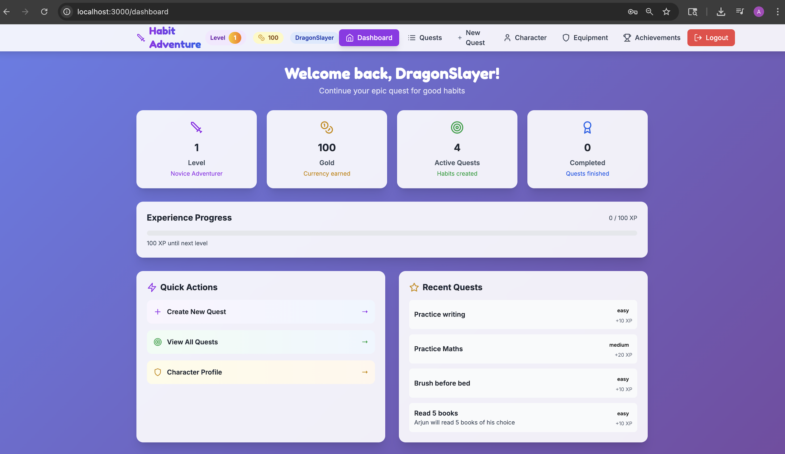

# 🎮 Habit Adventure - Epic Quest for Good Habits!

A fun and engaging habit tracking app designed specifically for kids, turning daily habits into an exciting role-playing adventure game. Complete quests, level up your character, earn gold, unlock equipment, and explore a fantasy world while building good habits!



## ✨ Features

### 🗡️ Adventure Theme
- **Character Creation**: Create your own adventurer with a unique name
- **Level System**: Gain experience points and level up your character
- **Gold Economy**: Earn gold coins by completing quests
- **Equipment System**: Unlock and collect gear as you progress
- **Achievement System**: Unlock achievements for milestones and challenges

### 📋 Habit Tracking
- **Quest Creation**: Turn habits into exciting quests with different difficulties
- **Daily Completion**: Mark quests as complete and earn rewards
- **Streak Tracking**: Build momentum with daily streaks
- **Categories**: Organize quests by type (health, learning, creativity, etc.)
- **Progress Visualization**: See your experience and level progress

### 🎨 Beautiful UI
- **Responsive Design**: Works perfectly on desktop, tablet, and mobile
- **Smooth Animations**: Engaging animations and transitions
- **Adventure Styling**: Fantasy-themed colors and graphics
- **Interactive Elements**: Hover effects and visual feedback

## 🚀 Tech Stack

### Frontend
- **React 18**: Modern React with hooks and functional components
- **TailwindCSS**: Utility-first CSS framework for beautiful styling
- **Framer Motion**: Smooth animations and transitions
- **Lucide React**: Beautiful icon library
- **React Router**: Client-side routing
- **Axios**: HTTP client for API calls
- **React Hot Toast**: Beautiful toast notifications
- **React Confetti**: Celebration effects for achievements

### Backend
- **Node.js**: JavaScript runtime
- **Express.js**: Web application framework
- **SQLite**: Lightweight database for local storage
- **JWT**: Authentication and authorization
- **bcryptjs**: Password hashing
- **UUID**: Unique identifier generation

## 📦 Installation & Setup

### Prerequisites
- Node.js (v16 or higher)
- npm or yarn

### 1. Clone the Repository
```bash
git clone <repository-url>
cd habit-adventure
```

### 2. Install Dependencies
```bash
# Install server dependencies
npm install

# Install client dependencies
cd client
npm install
cd ..
```

### 3. Start Development Servers
```bash
# Start both server and client in development mode
npm run dev

# Or start them separately:
npm run server    # Starts backend on port 5000
npm run client    # Starts frontend on port 3000
```

### 4. Access the Application
- Frontend: http://localhost:3000
- Backend API: http://localhost:5000

## 🎯 How to Use

### Getting Started
1. **Create Account**: Register with a username, password, and character name
2. **Create Quests**: Turn your habits into quests with different difficulties
3. **Complete Daily**: Mark quests as complete to earn XP and gold
4. **Level Up**: Gain experience to unlock new equipment and achievements
5. **Track Progress**: Monitor your character's growth and achievements

### Quest System
- **Easy Quests**: 10 XP, 5 Gold (simple daily tasks)
- **Medium Quests**: 20 XP, 10 Gold (moderate challenges)
- **Hard Quests**: 35 XP, 20 Gold (difficult goals)

### Level Progression
- **Level 1**: Novice Adventurer
- **Level 5**: Skilled Warrior
- **Level 10**: Heroic Champion
- **Level 15**: Legendary Master
- **Level 20**: Mythical Legend

### Equipment Unlocks
- **Level 2**: Wooden Sword (Common)
- **Level 3**: Leather Armor (Common)
- **Level 5**: Iron Sword (Uncommon)
- **Level 7**: Magic Staff (Rare)
- **Level 10**: Dragon Scale Armor (Epic)

## 🏗️ Project Structure

```
habit-adventure/
├── server/                 # Backend server
│   └── index.js           # Main server file
├── client/                # React frontend
│   ├── public/            # Static files
│   │   ├── components/    # React components
│   │   │   ├── auth/      # Authentication components
│   │   │   ├── dashboard/ # Dashboard components
│   │   │   ├── habits/    # Habit management
│   │   │   ├── character/ # Character and equipment
│   │   │   ├── achievements/ # Achievements system
│   │   │   └── common/    # Shared components
│   │   ├── contexts/      # React contexts
│   │   ├── App.js         # Main app component
│   │   └── index.js       # App entry point
│   ├── package.json       # Frontend dependencies
│   └── tailwind.config.js # Tailwind configuration
├── package.json           # Backend dependencies
└── README.md             # This file
```

## 🔧 Configuration

### Environment Variables
Create a `.env` file in the root directory:

```env
PORT=5000
JWT_SECRET=your-secret-key-here
NODE_ENV=development
```

### Database
The app uses SQLite for local storage. The database file (`habit_adventure.db`) will be created automatically when you first run the server.

## 🚀 Deployment

### For Production
1. **Build the Frontend**:
   ```bash
   cd client
   npm run build
   ```

2. **Deploy to EC2**:
   - Set up an EC2 instance
   - Install Node.js and PM2
   - Clone the repository
   - Install dependencies
   - Build the frontend
   - Start the server with PM2

### Example PM2 Configuration
```bash
pm2 start server/index.js --name "habit-adventure"
pm2 startup
pm2 save
```

## 🎨 Customization

### Colors and Theme
- Modify `client/tailwind.config.js` to change the color scheme
- Update `client/src/index.css` for custom animations
- Edit component styles in individual component files

### Game Mechanics
- Adjust XP and gold rewards in `server/index.js`
- Modify level requirements and equipment unlocks
- Add new achievement types and requirements

## 🤝 Contributing

1. Fork the repository
2. Create a feature branch (`git checkout -b feature/amazing-feature`)
3. Commit your changes (`git commit -m 'Add amazing feature'`)
4. Push to the branch (`git push origin feature/amazing-feature`)
5. Open a Pull Request

## 🙏 Acknowledgments

- **React Team**: For the amazing framework
- **TailwindCSS**: For the utility-first CSS framework
- **Framer Motion**: For smooth animations
- **Lucide**: For beautiful icons
- **All Contributors**: For helping make this project better

## 📞 Support

If you have any questions or need help, please open an issue on GitHub or contact the development team.

---

**Happy Adventuring! 🗡️✨**

*Turn your daily habits into an epic quest for personal growth!* 
